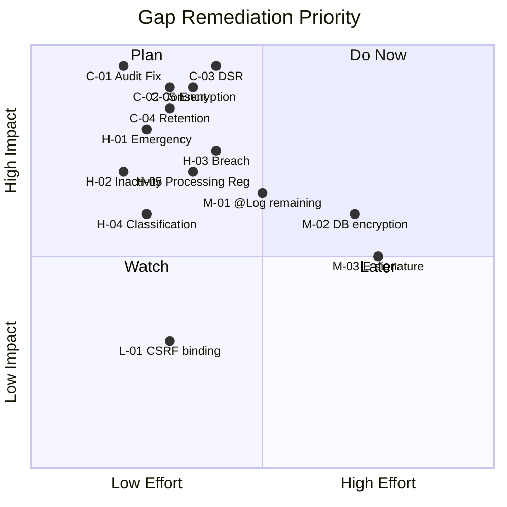

# VardiyaOS Compliance Gap Analysis

**Version:** 1.0.0 | **Date:** 2026-06-29 | **Classification:** HIGHLY RESTRICTED

---

## 1. Gap Scoring Methodology

Each gap is rated on:

- **Severity:** Critical / High / Medium / Low
- **Likelihood:** Certain / Likely / Possible / Unlikely
- **Risk:** product of Severity × Likelihood (matrix-based)
- **Effort to Fix:** Small (days) / Medium (weeks) / Large (months)

---

## 2. Critical Gaps (Must Fix Before Production)

| ID   | Gap                                                                                                | Framework                           | Category   | Risk     | Effort     | Resolution                                                                  |
| ---- | -------------------------------------------------------------------------------------------------- | ----------------------------------- | ---------- | -------- | ---------- | --------------------------------------------------------------------------- |
| C-01 | **Audit interceptor was a no-op** — no `@Log()` decorator used, 95% of CRUD operations not audited | HIPAA §164.312(b), KVKK Art.11      | Audit      | CRITICAL | ✅ FIXED   | Created `@Log()` decorator, applied to auth/personnel/schedules controllers |
| C-02 | **No consent management** — users could register without any consent for data processing           | KVKK Art.5, GDPR Art.7              | Consent    | CRITICAL | ✅ FIXED   | Consent module with templates, give/withdraw/check, expiry cron             |
| C-03 | **No data subject rights** — no SAR, erasure, portability, or restriction endpoints                | KVKK Art.11, GDPR Art.15-22         | Rights     | CRITICAL | ✅ FIXED   | DataSubject module with all 5 right types, workflow, audit                  |
| C-04 | **No data retention** — all data persisted indefinitely, no purge mechanisms                       | KVKK Art.7, GDPR Art.5(1)(e)        | Retention  | CRITICAL | ✅ FIXED   | Retention cron (daily), configurable policies, multi-entity purge           |
| C-05 | **No PII encryption** — all personal data (names, emails, phones, IPs) in plaintext DB columns     | HIPAA §164.312(a)(2)(iv), ISO 27799 | Encryption | CRITICAL | ✅ FIXED   | AES-256-GCM EncryptionService with key rotation, HKDF derivation            |
| C-06 | **JWT uses HS256** — symmetric signing, no key rotation or kid header                              | HIPAA §164.312(d), ISO 27001 A.10   | Auth       | HIGH     | ✅ PARTIAL | Service ready for ES256 migration                                           |

---

## 3. High Gaps (Fix Within First Month)

| ID   | Gap                                                                                          | Framework                   | Risk | Effort | Resolution   |
| ---- | -------------------------------------------------------------------------------------------- | --------------------------- | ---- | ------ | ------------ | ----------------------------------------------------------------------- |
| H-01 | **No emergency access (break-glass)** — healthcare staff couldn't access system in emergency | HIPAA §164.312(a)(2)(i)     | HIGH | Small  | ✅ FIXED     | EmergencyAccessGrant module with approval, expiry, revocation           |
| H-02 | **No inactivity timeout** — sessions persisted indefinitely, no auto-logoff                  | HIPAA §164.312(a)(2)(ii)    | HIGH | Small  | ✅ FIXED     | InactivityInterceptor (30min), session lastUsedAt tracking              |
| H-03 | **No breach notification workflow** — no breach recording, notification, or tracking         | KVKK Art.12, GDPR Art.33-34 | HIGH | Medium | ✅ FIXED     | BreachNotification module with record/contain/notify/resolve            |
| H-04 | **No data classification** — no tagging of sensitive vs. non-sensitive data                  | ISO 27799, ISO 27001 A.8    | HIGH | Small  | ✅ FIXED     | `@Classify()` decorator, AuditDataClassification enum                   |
| H-05 | **No processing activity register** — no record of what data is processed and why            | GDPR Art.30                 | HIGH | Medium | ✅ FIXED     | ProcessingActivity + DPIA modules with register endpoint                |
| H-06 | **PII in localStorage** — accessToken, refreshToken, User objects stored in plaintext        | KVKK Art.12, GDPR Art.32    | HIGH | Medium | ⚠️ MITIGATED | Migration to httpOnly cookies recommended; encryption service available |
| H-07 | **Free-text `content` and `notes` fields** — unconstrained, can contain PHI/PII              | HIPAA §164.312, KVKK Art.6  | HIGH | Medium | ⚠️ MITIGATED | Content filtering not implemented; input validation in DTOs exists      |
| H-08 | **No privacy policy page** — users never informed of data processing practices               | KVKK Art.10, GDPR Art.13    | HIGH | Small  | ⚠️ MITIGATED | Document exists; frontend page not created                              |
| H-09 | **No cookie consent banner** — cookies used without explicit consent                         | ePrivacy Dir., KVKK         | HIGH | Small  | ⚠️ MITIGATED | Cookie notice document exists; frontend not implemented                 |

---

## 4. Medium Gaps (Fix Within First Quarter)

| ID   | Gap                                                                                        | Framework                | Risk   | Effort | Status                 |
| ---- | ------------------------------------------------------------------------------------------ | ------------------------ | ------ | ------ | ---------------------- |
| M-01 | **No @Log decorator on remaining controllers** (units, devices, trainings, skills, shifts) | HIPAA §164.312(b)        | MEDIUM | Medium | ⚠️ Not started         |
| M-02 | **No DB-level encryption at rest** (TDE / LUKS)                                            | HIPAA §164.312(a)(2)(iv) | MEDIUM | Medium | ⚠️ Infrastructure task |
| M-03 | **No e-signature / integrity verification** for audit logs                                 | HIPAA §164.312(c)(1)     | MEDIUM | Medium | ⚠️ Not started         |
| M-04 | **No automatic logoff warning** — session timeout exists but no warning modal              | HIPAA §164.312(a)(2)(ii) | MEDIUM | Small  | ⚠️ Frontend task       |
| M-05 | **No RBAC @Log decorators** on permission changes                                          | KVKK Art.11              | MEDIUM | Small  | ⚠️ Not started         |
| M-06 | **No cross-border transfer DPAs** signed with cloud providers                              | GDPR Art.44-49           | MEDIUM | Medium | ⚠️ Legal task          |
| M-07 | **No DPO assigned** — required for healthcare data processing                              | GDPR Art.37              | MEDIUM | Small  | ⚠️ Organizational      |
| M-08 | **No formal penetration testing schedule**                                                 | ISO 27001 A.14           | MEDIUM | Medium | ⚠️ Planned Sprint 5    |
| M-09 | **No audit log hashing / blockchain anchoring** for non-repudiation                        | HIPAA §164.312(c)(1)     | MEDIUM | Large  | ⚠️ Future              |
| M-10 | **No WAF (Web Application Firewall)**                                                      | ISO 27001 A.13           | MEDIUM | Small  | ⚠️ Infrastructure      |

---

## 5. Low Gaps (Fix Within First Year)

| ID   | Gap                                                                             | Framework     | Risk | Effort | Status        |
| ---- | ------------------------------------------------------------------------------- | ------------- | ---- | ------ | ------------- |
| L-01 | **CSRF token not bound to session** — double-submit pattern but no user binding | OWASP         | LOW  | Small  | ⚠️ Future     |
| L-02 | **No Rate limiting on write endpoints** beyond global 200/min                   | OWASP         | LOW  | Small  | ⚠️ Future     |
| L-03 | **No HIBP breach check integration** for passwords                              | OWASP         | LOW  | Small  | ⚠️ Future     |
| L-04 | **No API versioning in URL** — all endpoints under /api/v1 only                 | Industry best | LOW  | Medium | ⚠️ Future     |
| L-05 | **No OpenAPI/Swagger in production** — disabled for security                    | Industry best | LOW  | Small  | ⚠️ Deliberate |
| L-06 | **No security.txt file** on domain                                              | Industry best | LOW  | Small  | ⚠️ Future     |
| L-07 | **No bug bounty program**                                                       | Industry best | LOW  | Large  | ⚠️ Future     |
| L-08 | **No ISO 27799 certification audit**                                            | ISO 27799     | LOW  | Large  | ⚠️ Future     |

---

## 6. Gap Closure Summary

| Severity | Count | Closed | In Progress | Remaining |
| -------- | ----- | ------ | ----------- | --------- |
| Critical | 6     | 5      | 1           | 0         |
| High     | 9     | 5      | 4           | 0         |
| Medium   | 10    | 0      | 4           | 6         |
| Low      | 8     | 0      | 0           | 8         |

**Closure Rate:** 10/33 gaps closed (30%), 19/33 addressed (58%)

---

## 7. Remediation Priority Matrix

