# VardiyaOS Final Architecture Diagram

> **Date:** June 29, 2026
> **Classification:** Confidential — Architecture Reference

---

## 1. System Architecture Overview

```mermaid
flowchart TB
    %% ==========================================
    %% LAYER 0: CLIENT LAYER
    %% ==========================================
    subgraph CLIENT["🌐 Client Layer"]
        C1["🖥️ Browser (Angular SPA + PWA)
             Angular 21 Standalone
             PrimeNG 21 • Signals • OnPush
             30+ lazy-loaded routes
             Service Worker (11 data groups)"]
        C2["📱 Mobile (Capacitor 8)
             Android • iOS
             Push Notifications
             Offline Support
             Dark Theme"]
        C3["🔌 External APIs
             Slack (Alerts)
             SendGrid (Email)
             Firebase FCM (Push)"]
    end

    %% ==========================================
    %% LAYER 1: CDN / LOAD BALANCER
    %% ==========================================
    subgraph CDN["☁️ CDN / Load Balancer"]
        LB1["Cloudflare DNS
             DDoS Protection
             SSL Termination"]
        LB2["Istio Ingress Gateway
             HTTPS :443  HTTP→HTTPS redirect
             TLS 1.3 • HSTS"]
    end

    CLIENT --> |"HTTPS :443"| CDN

    %% ==========================================
    %% LAYER 2: FRONTEND LAYER
    %% ==========================================
    subgraph FE["🎨 Frontend Layer (K8s Pods ×3)"]
        direction TB
        FE_A["Angular 21 Standalone SPA
              @angular/core ^21.2.0
              @angular/service-worker ^21.2.9
              primeng ^21.1.6
              @capacitor/core"]
        FE_SW["Service Worker (ngsw-config.json)
              11 data groups:
              api-schedules (freshness, 5m)
              api-my-shifts (performance, 30m)
              api-personnel (performance, 1h)
              api-devices (performance, 1h)
              api-units (performance, 1h)
              api-notifications (freshness, 2m)
              api-analytics (freshness, 10m)
              api-attendance (freshness, 5m)
              api-shift-tasks (freshness, 5m)
              api-handover-notes (freshness, 5m)
              api-device-incidents (freshness, 5m)"]
        FE_ST["Signal Stores
              ScheduleStore • MetricsStore
              UnitStore • PersistenceStore"]
        FE_RO["30+ Lazy-Loaded Routes
              /app/dashboard  /app/operations
              /app/mr-plan    /app/bt-plan
              /app/employees  /app/login
              /app/my-day     /app/my-shifts
              /app/shifts     /app/swap-requests
              /app/audit      /app/analytics
              /app/command-center
              /app/skills     /app/training
              /app/devices    /app/device-incidents
              /app/reports    /app/settings"]
    end

    CDN --> |"Istio VirtualService
              '/api' → backend
              '/*' → frontend"| FE

    %% ==========================================
    %% LAYER 3: API GATEWAY LAYER (Istio)
    %% ==========================================
    subgraph GW["🔐 API Gateway Layer (Istio)"]
        direction TB
        GW_VS["VirtualService
               Timeout: 60s
               Retries: 3 (connect-failure,
                         refused-stream,
                         unavailable, cancelled)
               PerTryTimeout: 10s"]
        GW_AUTH["Authorization Policy
                 JWT Validation (RequestAuthentication)
                 Istio mTLS STRICT
                 Source: istio-ingressgateway SA only"]
        GW_RL["Rate Limiting
               200/min global
               Per-endpoint limits
               CORS: app.vardiya.com"]
    end

    FE --> GW

    %% ==========================================
    %% LAYER 4: BACKEND SERVICES LAYER
    %% ==========================================
    subgraph BE["⚙️ Backend Services Layer (NestJS 44 modules, K8s Pods ×3)"]
        direction TB

        subgraph BE_AUTH["Auth Module"]
            A1["JWT (HS256, 15min access / 7d refresh)
                CSRF Token
                Session Management
                Rate Limiting
                Token Blacklist
                Invite Code
                bcrypt(13) password hashing"]
        end

        subgraph BE_CORE["Core Business Modules"]
            B1["Schedules • Personnel • Shifts
                Units • Attendance
                HandoverNotes • SwapRequests
                ShiftTasks • Holidays"]
        end

        subgraph BE_COMP["Compliance Modules"]
            B2["Encryption (AES-256-GCM)
                Consent (10 templates)
                DataSubject (9 DSAR rights)
                DataRetention (7 cron policies)
                EmergencyAccess (break-glass)
                BreachNotification (72h flow)
                ProcessingActivity (Art. 30)
                DataClassification
                AuditLog (@Log decorator)"]
        end

        subgraph BE_COMM["Communication"]
            B3["Notifications
                PushSubscriptions
                PushTokens (Web Push VAPID)
                WebSocket (Socket.IO)"]
        end

        subgraph BE_SKILLS["Skills & Training"]
            B4["Skills • Training"]
        end

        subgraph BE_DEV["Device Management"]
            B5["Devices • DeviceIncidents
                DeviceStatus"]
        end

        subgraph BE_ANALYTICS["Analytics"]
            B6["Analytics • Insights
                Recommendations
                CommandCenter"]
        end

        subgraph BE_INFRA["Infrastructure"]
            B7["Health (liveness/readiness)
                Metrics (Prometheus /metrics)
                RBAC (Role hierarchy)
                Me (profile endpoint)
                Vault integration
                Alerting
                Correlation
                EventBus"]
        end
    end

    GW --> |"Istio mTLS STRICT"| BE

    %% ==========================================
    %% LAYER 5: INFRASTRUCTURE LAYER
    %% ==========================================
    subgraph INFRA["🏗️ Infrastructure Layer"]
        direction TB

        subgraph INFRA_MESH["Service Mesh (Istio)"]
            I1["STRICT mTLS (PeerAuthentication)
                DestinationRules (outlier detection)
                RequestAuthentication (JWT)
                AuthorizationPolicy
                Telemetry (traces)"
                ]
        end

        subgraph INFRA_GITOPS["GitOps (ArgoCD)"]
            I2["6 Applications:
                vardiya-platform (Helm umbrella)
                vardiya-infrastructure (networking, cert-manager, sealed-secrets, OTEL)
                vardiya-service-mesh (Istio Gateway, mTLS)
                vardiya-rollouts (blue-green backend, canary frontend)
                vardiya-feature-flags (Unleash)
                vardiya-prometheus-operator (ServiceMonitors, Rules)"]
        end

        subgraph INFRA_ROLL["Argo Rollouts"]
            I3["Backend: Blue-Green
                 Active/Preview services
                 Smoke tests → auto-promote
                 5min scale-down delay
                ───
                 Frontend: Canary
                 Istio traffic split
                 10%→30%→50%→70%→100%
                 5-10min pauses + analysis"]
        end

        subgraph INFRA_TLS["cert-manager"]
            I4["3 ClusterIssuers:
                letsencrypt-production (ACME DNS-01 Cloudflare)
                letsencrypt-staging
                selfsigned
                ───
                3 Certificates (ECDSA P256)
                vardiya-tls (90d, renew 30d before)
                vardiya-unleash-tls
                vardiya-grafana-tls"]
        end

        subgraph INFRA_FF["Feature Flags (Unleash)"]
            I5["2 replicas (HPA 2-6)
                PostgreSQL backend
                Client SDK integration
                Toggle management UI"]
        end

        subgraph INFRA_SEC["Secrets & Security"]
            I6["Sealed Secrets (Bitnami)
                90-day rotation
                kubeseal encryption
                Safe to commit to git
                ───
                NetworkPolicy: default-deny-all
                PSA: restricted (vardiya namespace)
                PSA: baseline (monitoring, feature-flags)"]
        end
    end

    BE --- INFRA

    %% ==========================================
    %% LAYER 6: DATA LAYER
    %% ==========================================
    subgraph DATA["🗄️ Data Layer"]
        direction TB

        subgraph DATA_PG["PostgreSQL"]
            D1["PgBouncer connection pooling
                10 composite indexes
                PITR backups
                NetworkPolicy: backend + pgbouncer only"]
        end

        subgraph DATA_REDIS["Redis"]
            D2["3-node Sentinel (HA)
                AOF persistence
                BullMQ job queues
                Session cache + rate limiting"
                ]
        end
    end

    BE --> DATA

    %% ==========================================
    %% LAYER 7: OBSERVABILITY LAYER
    %% ==========================================
    subgraph OBSERV["📊 Observability Layer"]
        direction TB

        subgraph OBSERV_MET["Metrics"]
            O1["Prometheus (30d retention)
                postgres-exporter
                redis-exporter
                Istio Envoy metrics
                ArgoCD metrics"]
        end

        subgraph OBSERV_LOG["Logs"]
            O2["Loki (30d retention)
                Structured JSON logging
                LogQL queries"]
        end

        subgraph OBSERV_TRACE["Traces"]
            O3["Tempo (48h retention)
                OpenTelemetry Collector
                Istio telemetry → OTEL
                Traces correlated with logs/metrics"]
        end

        subgraph OBSERV_ALERT["Alerting"]
            O4["AlertManager
                → Slack #alerts
                → Slack #alerts-critical
                15+ Prometheus rules
                (latency, error budget, saturation)"]
        end

        subgraph OBSERV_DASH["Dashboards"]
            O5["Grafana (dark-mode)
                Auto-provisioned datasources:
                Prometheus, Loki, Tempo
                Pre-built dashboards:
                Kubernetes, Node Exporter,
                PostgreSQL, Redis, VardiyaOS App"]
        end
    end

    DATA -.-> OBSERV
    BE -.-> OBSERV
    INFRA -.-> OBSERV

    %% ==========================================
    %% LAYER 8: CI/CD LAYER
    %% ==========================================
    subgraph CICD["🔄 CI/CD Layer"]
        CICD_GH["GitHub Actions
                 4 workflows:
                 ─ ci.yml (build + test)
                 ─ pr-validation.yml (lint + typecheck + test)
                 ─ deploy.yml (build image + rollout)
                 ─ security-scan.yml (gitleaks + npm audit)"]
        CICD_DB["Dependabot
                 npm (backend, frontend)
                 GitHub Actions
                 Docker
                 Weekly schedule / Monthly Docker"]
        CICD_HUSKY["Husky + lint-staged + commitlint
                    Pre-commit: prettier + typecheck
                    Commit messages: conventional commits"]
    end

    CICD -.-> |"Build & Deploy"| INFRA_GITOPS
    CICD -.-> |"Static Analysis"| BE

    %% ==========================================
    %% EXTERNAL SERVICE FLOWS
    %% ==========================================
    BE_COMM --> |"SendGrid SMTP"| C3
    BE_COMM --> |"Firebase FCM"| C3
    OBSERV_ALERT --> |"Slack Webhook"| C3

    %% ==========================================
    %% STYLING
    %% ==========================================
    classDef client fill:#1a1a2e,color:#e0e0ff,stroke:#4a4a8a,stroke-width:2px
    classDef cdn fill:#16213e,color:#e0e0ff,stroke:#3a6a9a,stroke-width:2px
    classDef fe fill:#0f3460,color:#e0e0ff,stroke:#5390d9,stroke-width:2px
    classDef gw fill:#533483,color:#e0e0ff,stroke:#7b5ea7,stroke-width:2px
    classDef be fill:#1b4332,color:#e0ffe0,stroke:#40916c,stroke-width:2px
    classDef infra fill:#3d2c2c,color:#ffe0e0,stroke:#a05a5a,stroke-width:2px
    classDef data fill:#2c3d3d,color:#e0ffff,stroke:#5a9a9a,stroke-width:2px
    classDef observ fill:#2c2c3d,color:#ffffe0,stroke:#9a9a5a,stroke-width:2px
    classDef cicd fill:#2d2d2d,color:#e0e0e0,stroke:#808080,stroke-width:2px

    class C1,C2,C3 client
    class LB1,LB2 cdn
    class FE_A,FE_SW,FE_ST,FE_RO fe
    class GW_VS,GW_AUTH,GW_RL gw
    class BE_AUTH,BE_CORE,BE_COMP,BE_COMM,BE_SKILLS,BE_DEV,BE_ANALYTICS,BE_INFRA be
    class I1,I2,I3,I4,I5,I6 infra
    class D1,D2 data
    class O1,O2,O3,O4,O5 observ
    class CICD_GH,CICD_DB,CICD_HUSKY cicd
```



---

## 2. Compliance Architecture

```mermaid
flowchart TB
    %% ==========================================
    %% CONSENT FLOW
    %% ==========================================
    subgraph CONSENT["📋 Consent Lifecycle"]
        direction LR
        CT["ConsentTemplate
            10 templates
            DataProcessing
            Communication
            PushNotifications
            BiometricAuth"]
        CT --> |"User reads template"| CU["User Gives Consent
                                            ConsentStatus: ACTIVE
                                            Records timestamp + IP
                                            Stores ConsentRecord"]
        CU --> |"System checks consent"| CS["System Validation
                                              Before processing PHI/PII
                                              Check ConsentStatus
                                              Verify not expired/withdrawn"]
        CS --> |"Auto-expires"| CE["Auto-Expiry
                                    Cron: daily
                                    Withdrawn + 1yr → purge
                                    Status → EXPIRED"]
        CS --> |"User withdraws"| CW["Withdrawal
                                      POST /api/v1/consent/me/withdraw/:id
                                      Status → WITHDRAWN
                                      Audit logged"]
    end

    %% ==========================================
    %% DSR FLOW
    %% ==========================================
    subgraph DSR["🔍 Data Subject Request (DSR) Flow"]
        direction LR
        DSR_IN["User submits request
                Type: ERASURE / EXPORT / RECTIFY / RESTRICT
                POST /api/v1/data-subject/me/{action}"]
        DSR_IN --> |"Admin reviews"| DSR_ADMIN["Admin processes
                                                  Within 30 days (GDPR)
                                                  Verify identity
                                                  Log to DataSubjectRequestAuditLog"]
        DSR_ADMIN --> |"Erasure"| DSR_ERA["Erasure (Right to be forgotten)
                                            Anonymize PII fields
                                            Disable account
                                            Keep audit trail (anonymous)
                                            POST /api/v1/data-subject/me/erasure"]
        DSR_ADMIN --> |"Export"| DSR_EXP["Export (Data portability)
                                           JSON snapshot of ALL user data
                                           Structured, machine-readable
                                           POST /api/v1/data-subject/me/portability"]
        DSR_ADMIN --> |"Rectify"| DSR_REC["Rectification
                                            Update user data
                                            Log change
                                            POST /api/v1/data-subject/me/rectification"]
        DSR_ADMIN --> |"Restrict"| DSR_RES["Restriction of processing
                                             Set restriction flag
                                             Limit data usage
                                             POST /api/v1/data-subject/me/restriction"]
    end

    %% ==========================================
    %% RETENTION FLOW
    %% ==========================================
    subgraph RET["⏰ Data Retention (7 Policies, 4 Daily Cron Jobs)"]
        direction TB
        RET_CRON["Cron Schedule (daily)
                  DataRetentionService.processAll()"]
        RET_CRON --> RET_AUTH["Auth records
                               Failed attempts: 90d → purge
                               Revoked sessions: 30d → purge
                               Token blacklist: expiry + 1d → purge"]
        RET_CRON --> RET_AUDIT["Audit logs
                                10yr retention
                                5yr → archive
                                10yr → purge"]
        RET_CRON --> RET_NOTIF["Notifications
                                2yr retention
                                1yr → archive
                                2yr → purge"]
        RET_CRON --> RET_CONSENT["Consents
                                  Withdrawn + 1yr → purge
                                  Active → keep"]
        RET_CRON --> RET_DEVICE["Device status logs
                                 1yr retention
                                 6mo → archive
                                 1yr → purge"]
    end

    %% ==========================================
    %% EMERGENCY ACCESS FLOW
    %% ==========================================
    subgraph EA["🚨 Emergency Access (Break-Glass)"]
        direction LR
        EA_REQ["Admin requests access
                Reason: patient safety / system outage
                EmergencyAccessReason enum"]
        EA_REQ --> EA_GRANT["Grant issued
                              Duration: 60 minutes
                              Scope: targeted entity/route
                              Status: ACTIVE
                              Logged to EmergencyAccessGrant"]
        EA_GRANT --> EA_TARGET["Target Access
                                 Bypasses normal RBAC
                                 Full audit trail
                                 Real-time notification to security team"]
        EA_TARGET --> EA_REVOKE["Revocable
                                  Auto-expire after 60min
                                  Manual revoke by super-admin
                                  POST /api/v1/emergency-access/:id/revoke
                                  Status → REVOKED or EXPIRED"]
    end

    %% ==========================================
    %% BREACH NOTIFICATION FLOW
    %% ==========================================
    subgraph BN["⚠️ Breach Notification (HIPAA §164.400 / GDPR Art. 33-34)"]
        direction LR
        BN_RECORD["Record incident
                   DataBreachRecord created
                   Severity: LOW / MEDIUM / HIGH / CRITICAL
                   Timestamp + discoverer + description"]
        BN_RECORD --> BN_CONTAIN["Containment
                                   Isolate affected systems
                                   Stop ongoing data exposure
                                   Log containment actions"]
        BN_CONTAIN --> BN_AUTH["Notify Authority
                                 HIPAA: within 60 days
                                 GDPR: within 72 hours
                                 Include: nature, volume, risk, actions"]
        BN_AUTH --> BN_SUBJECTS["Notify Data Subjects
                                  If high risk to rights/freedoms
                                  Describe breach + recommendations
                                  Contact via email / in-app notification"]
        BN_SUBJECTS --> BN_RESOLVE["Resolve
                                     Post-incident review
                                     Root cause analysis
                                     Update security measures
                                     Close breach record"]
    end

    %% ==========================================
    %% CROSS-CUTTING: AUDIT LOG
    %% ==========================================
    AUDIT["📝 Audit Log (@Log decorator)
           Captures: before/after values, actor, IP, timestamp
           10yr retention
           Data classification attached
           Suspicious activity detection
           All compliance flows logged"]

    CONSENT -.-> |"Each consent action logged"| AUDIT
    DSR -.-> |"Each DSR step logged"| AUDIT
    RET -.-> |"Each purge/archive logged"| AUDIT
    EA -.-> |"Each access grant/revoke logged"| AUDIT
    BN -.-> |"Each breach action logged"| AUDIT

    %% ==========================================
    %% STYLING
    %% ==========================================
    classDef consent fill:#1a2e1a,color:#e0ffe0,stroke:#4a8a4a,stroke-width:2px
    classDef dsr fill:#2e1a2e,color:#ffe0ff,stroke:#8a4a8a,stroke-width:2px
    classDef ret fill:#1a1a2e,color:#e0e0ff,stroke:#4a4a8a,stroke-width:2px
    classDef ea fill:#2e2e1a,color:#ffffe0,stroke:#8a8a4a,stroke-width:2px
    classDef bn fill:#2e1a1a,color:#ffe0e0,stroke:#8a4a4a,stroke-width:2px
    classDef audit fill:#1a2e2e,color:#e0ffff,stroke:#4a8a8a,stroke-width:2px

    class CT,CU,CS,CE,CW consent
    class DSR_IN,DSR_ADMIN,DSR_ERA,DSR_EXP,DSR_REC,DSR_RES dsr
    class RET_CRON,RET_AUTH,RET_AUDIT,RET_NOTIF,RET_CONSENT,RET_DEVICE ret
    class EA_REQ,EA_GRANT,EA_TARGET,EA_REVOKE ea
    class BN_RECORD,BN_CONTAIN,BN_AUTH,BN_SUBJECTS,BN_RESOLVE bn
    class AUDIT audit
```



---

## 3. Key Technology Versions

| Component     | Version | Detail                                 |
| ------------- | ------- | -------------------------------------- |
| Angular       | 21.2.0  | Standalone components, Signals, OnPush |
| PrimeNG       | 21.1.6  | UI component library                   |
| Capacitor     | 8.x     | Mobile wrapper                         |
| NestJS        | Latest  | 44 backend modules                     |
| Prisma        | Latest  | ORM with 11 compliance models          |
| PostgreSQL    | 16      | Primary database                       |
| Redis         | 7       | Cache + BullMQ queues                  |
| Istio         | Latest  | Service mesh, mTLS, traffic mgmt       |
| ArgoCD        | Latest  | GitOps operator                        |
| Argo Rollouts | Latest  | Blue-green + canary deployments        |
| cert-manager  | Latest  | ACME DNS-01 (Cloudflare)               |
| Unleash       | Latest  | Feature flags (2-6 HPA)                |
| Prometheus    | Latest  | 30d metric retention                   |
| Loki          | Latest  | 30d log retention                      |
| Tempo         | Latest  | 48h trace retention                    |
| Grafana       | Latest  | Dark-mode, auto-provisioned            |

## 4. Data Flow Summary

```
User (Browser/Mobile)
  → Cloudflare DNS
    → Istio Ingress Gateway (HTTPS :443)
      → Istio VirtualService
        ├── /api/* → NestJS Backend (3 pods, blue-green)
        │     ├── JWT Validation (mesh + app level)
        │     ├── Rate Limiting (200/min)
        │     ├── CSRF Protection
        │     ├── Business Logic (44 modules)
        │     ├── PgBouncer → PostgreSQL (PITR)
        │     ├── Redis Sentinel (3-node, AOF)
        │     └── BullMQ Queues
        └── /* → Angular Frontend (3 pods, canary)
              ├── Service Worker (11 data groups, offline)
              ├── Lazy-loaded routes (30+)
              └── Signal Stores (reactive state)

Observability:
  Metrics  → Prometheus (30d)  → Grafana
  Logs     → Loki (30d)        → Grafana
  Traces   → OTEL → Tempo (48h)→ Grafana
  Alerts   → AlertManager      → Slack (#alerts, #alerts-critical)

CI/CD:
  GitHub Push → GitHub Actions → Build → Deploy → ArgoCD Sync → Rollout
  Dependabot  → Automated PRs  → Security scans (gitleaks, npm audit)
  Husky       → Pre-commit lint-staged → commitlint conventional commits
```
